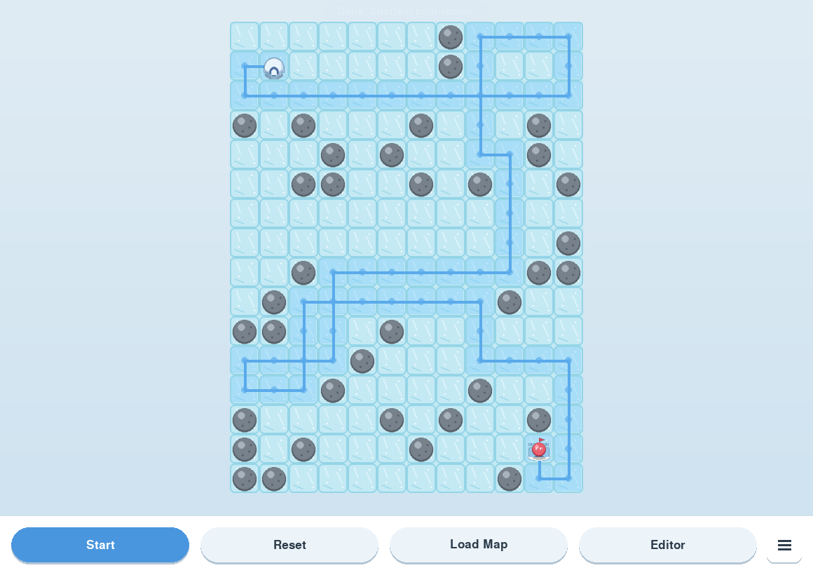
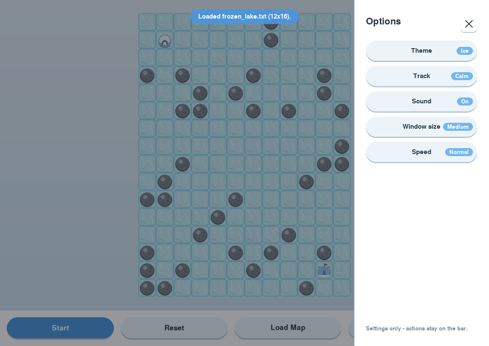

<div align="center">

# ❄️ Sliding Puzzle Pathfinder

### *Watch an algorithm think - one frozen step at a time.*

A desktop game where an **A\*** search agent solves sliding-ice puzzles
and walks the shortest path to the goal, live, before your eyes.



[](https://www.python.org/)
[](https://www.pygame.org/)
[](#-license)


</div>

---

## 🧊 What is this?

Imagine standing on a sheet of frictionless ice. You pick a direction -
and you **keep sliding** until a rock or a wall stops you. You can't just
walk one tile at a time; every move is a full slide. Now find your way
from the **igloo** to the **castle** in as few moves as possible.

That's the puzzle. The twist of this project is that **you don't solve it
you watch the computer solve it.** Press *Start* and an artificial
intelligence search algorithm called **A\*** ("A-star") plans the
shortest possible route and the player glides along it, the ice lighting
up tile by tile to reveal the path.

> **For non-technical readers:** think of it as a satisfying little
> puzzle toy that also shows you *how a computer reasons about finding
> the best route* - the same family of algorithms that powers GPS
> navigation and game characters.

> **For technical readers:** it's a clean implementation of A\* on a
> non-standard reachability graph (slide-to-stop movement), wrapped in a
> polished Pygame front-end with eased animation, a level editor, and
> theming. Built originally for a university Algorithms module and
> developed into a full product.

---

## ✨ Features

| | |
|---|---|
| 🤖 **Live A\* solver** | Watch the shortest path get discovered and walked out in real time |
| 🧊 **Brick-by-brick trail** | Each ice tile lights up smoothly as the player slides over it |
| 🎬 **Eased animation** | Natural acceleration and deceleration - no robotic, jerky motion |
| 🗺️ **Load any map** | Drop in your own `.txt` puzzle and solve it instantly |
| 🛠️ **Built-in level editor** | Click to place rocks, start and finish; save your creations |
| 🎨 **3 colour themes** | Ice, Sunset and Midnight - each a hand-tuned palette |
| 🎵 **3 music tracks** | Calm, Upbeat and Mystery, generated procedurally |
| 📐 **Resizable & scalable** | Three preset window sizes, plus free-form resizing |
| 🍔 **Clean UI** | Four key actions on a bar; the rest tucked in a slide-out menu |

---

## 🎮 How to play

1. **Launch the game** - the puzzle loads automatically.
2. **Press `Start`** - sit back and watch A\* find and walk the shortest path.
3. **Press `Reset`** to clear the trail and run it again.
4. **`Load Map`** to open your own puzzle file.
5. **`Editor`** to build a puzzle from scratch.
6. Tap the **menu icon** (☰) for themes, music, speed and window size.

The **igloo** is the start, the **castle** is the goal, the **grey
boulders** stop your slide, and the pale blue tiles are the ice.

---

## 🖼️ A look inside

**The options menu - slides in only when you need it, so the board stays the star:**



**The art - pixel sprites generated entirely in code (no external files needed):**


---

## 🚀 Getting started

### Requirements
- **Python 3.10 or newer**
- **Pygame** - the only dependency

### Install & run

```bash
# 1. Get the code
git clone https://github.com/YOUR_USERNAME/sliding-puzzle-pathfinder.git
cd sliding-puzzle-pathfinder

# 2. Install the one dependency
python -m pip install pygame

# 3. Play
python main.py
```

> 💡 **Tip:** use `python -m pip` (not bare `pip`) so the install lands
> in the same Python that runs the game.

---

## 🧠 How it works - the algorithm

The interesting part of this project is *the search*.

A normal grid lets you step to any neighbouring tile. Here, movement is
**slide-to-stop**: one move carries you across many tiles until something
blocks you. So the program first reframes the puzzle as a **graph**:

- **Nodes** - every square the player can come to *rest* on.
- **Edges** - a single slide, connecting one rest-square to the next.
- **Edge cost** - always `1`, because the puzzle counts *moves*, not tiles.

It then runs **A\* search** over that graph. A\* is a best-first search
that combines the cost so far with an *estimate* of the cost remaining.
The estimate (the "heuristic") used here is:

```
remaining moves  ≥  Manhattan distance ÷ longest possible slide
```

Because a single slide can never cover more than the longest possible
slide, this estimate is **admissible** - it never overshoots - which
mathematically **guarantees A\* returns a genuinely shortest path**. ✅

📄 A full write-up - data structures, a worked example, and an empirical
performance analysis with Big-O classification - lives in
[`report/Task5_Report.md`](report/Task5_Report.md).

---

## 🗂️ Project structure

```
pathfinder_game/
├── main.py              ▸ entry point
├── core/                ▸ pure algorithm logic - no game engine here
│   ├── map_parser.py        reads & validates .txt maps
│   ├── grid.py              the map + slide-to-stop physics
│   └── solver.py            the A* shortest-path search
├── game/                ▸ the Pygame front-end
│   ├── app.py               main loop & state machine
│   ├── renderer.py          board, sprites, animated trail
│   ├── ui.py                buttons & the slide-out menu
│   ├── editor.py            the in-game level editor
│   ├── easing.py            smooth-motion maths
│   ├── audio.py             procedural music
│   ├── settings.py          themes, sizes, options
│   └── sprite_gen.py        generates the pixel-art sprites
├── maps/                ▸ sample & benchmark puzzles
├── assets/              ▸ generated sprites & music
└── report/              ▸ algorithm analysis
```

A deliberate design choice: **`core/` has zero dependency on Pygame.**
The algorithm can be tested, reused, or deployed entirely on its own -
the game is just one possible front-end for it.

---

## 🧩 Make your own puzzles

Maps are plain text - anyone can write one in a text editor:

```
S....0....
....0.....
0.....0..0
.F......0.
.0........
```

| Symbol | Meaning |
|:------:|---------|
| `.` | empty ice (you slide across it) |
| `0` | rock - stops your slide |
| `S` | start (exactly one) |
| `F` | finish (exactly one) |

Save it as a `.txt` file and open it with **Load Map** - or build one
visually with the in-game **Editor**.

---

## 🛠️ Built with

- **[Python](https://www.python.org/)** - core language
- **[Pygame](https://www.pygame.org/)** - rendering, input and audio
- **A\* search** - the shortest-path algorithm at the heart of it
- Custom easing functions for animation - no heavy dependencies

---

## 🗺️ Roadmap

- [ ] Sound effects (slide *whoosh*, victory chime)
- [ ] A title screen and level-select
- [ ] Move counter & "best solve" tracking
- [ ] An online solver demo anyone can try in a browser

---

## 📜 License

Released under the **MIT License** - free to use, study and build on.

---

## 🙋 About

This project began as coursework for the **5SENG003W Algorithms**
module and grew into a complete, polished game. It demonstrates
algorithm design, clean software architecture, and a focus on user
experience.

<div align="center">

*If you enjoyed this, a ⭐ on the repo is always appreciated!*

</div>
